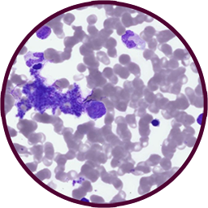

<h1 style="text-align: center;">Microscopy-KI-Extension</h1>

A chrome extension for <a href="http://mikroskop.neuro.ki.se">mikroskop.neuro.ki.se</a> to more effectively study histology

## Installation
*either follow google's guide [here](https://developer.chrome.com/docs/extensions/get-started/tutorial/hello-world#load-unpacked) or follow the instructions below*
1. First off, this is a chrome extension, so you need to have Google Chrome installed on your computer. If you don't have it, you can download it [here](https://www.google.com/chrome/).
1. Download the code from this repository, unzip it, and locate the **Extension** folder\
    
1. Type `chrome://extensions/` in the address bar of chrome, or open chrome and go to the menu (three dots in the top right corner) -> More tools -> Extensions\
    
1. Enable **Developer mode** in the top right corner\
    
1. Click **Load unpacked** and select the **Extension** folder from the folder that was downloaded and unzipped\
 ***Not the unzipped folder, but the subfolder called "Extension"***\
     \
    
1. The extension should now be installed and ready to use!

## Usage
* Go to `http://mikroskop.neuro.ki.se/` (or click the link in the extension popup)
* Input what area you want to study in the propmt that appears when entering the site
* Press **Space** to get a new random image from your selected area of interest
* You can also hover your mouse over the gray box in the top left corner to see what the name of the current image is
* To study another area, simply refresh the page and input a new area in the prompt